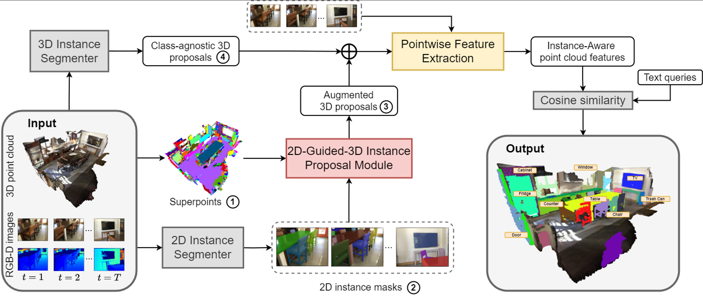

	
[](https://paperswithcode.com/sota/3d-open-vocabulary-instance-segmentation-on-1?p=open3dis-open-vocabulary-3d-instance)
	
[](https://paperswithcode.com/sota/3d-open-vocabulary-instance-segmentation-on-2?p=open3dis-open-vocabulary-3d-instance)
	
[](https://paperswithcode.com/sota/3d-open-vocabulary-instance-segmentation-on?p=open3dis-open-vocabulary-3d-instance)
	
[](https://paperswithcode.com/sota/3d-instance-segmentation-on-scannet200?p=open3dis-open-vocabulary-3d-instance)

##### Table of contents
1. [Installation guide](#Installation_guide)
2. [Data Preparation](#Data_Preparation) 
3. [Run the code](#Run_the_code)
4. [Acknowledgments](#Acknowledgments)
5. [Contacts](#Contacts)

# Open3DIS: Open-Vocabulary 3D Instance Segmentation with 2D Mask Guidance [CVPR'24](https://cvpr.thecvf.com/)

by [Phuc Nguyen](https://github.com/PhucNDA/), [Tuan Duc Ngo](https://ngoductuanlhp.github.io/), [Evangelos Kalogerakis](https://people.cs.umass.edu/~kalo/), [Chuang Gan](https://people.csail.mit.edu/ganchuang/), [Anh Tran](https://scholar.google.com/citations?user=FYZ5ODQAAAAJ&hl=en), [Cuong Pham](https://sites.google.com/view/cuongpham/home), and [Khoi Nguyen](https://www.khoinguyen.org)

<a href="https://open3dis.github.io/"></a>
<a href="https://arxiv.org/abs/2312.10671"></a>

<!-- <a href="https://open3dis.github.io/"></a>
<a href="https://arxiv.org/abs/2312.10671"></a>

<div align="center">
<a href="https://github.com/PhucNDA" target="_blank">Phuc&nbsp;Nguyen</a> &emsp; <b>&middot;</b> &emsp;
<a href="https://ngoductuanlhp.github.io/" target="_blank">Tuan&nbsp;Duc&nbsp;Ngo</a>
<br><br>
<a href="https://people.cs.umass.edu/~kalo/" target="_blank">Evangelos&nbsp;Kalogerakis</a></b> &emsp; &middot;&emsp;
<a href="https://people.csail.mit.edu/ganchuang/" target="_blank">Chuang&nbsp;Gan</a> &emsp;
<br><br>
<a href="https://scholar.google.com/citations?user=FYZ5ODQAAAAJ&hl=en" target="_blank">Anh&nbsp;Tran</a> &emsp; <b>&middot;</b> &emsp;
<a href="https://sites.google.com/view/cuongpham/home" target="_blank">Cuong&nbsp;Pham</a> &emsp; <b>&middot;</b> &emsp;
<a href="https://www.khoinguyen.org/" target="_blank">Khoi&nbsp;Nguyen</a>  -->
<!-- <br><br> -->
<!-- VinAI Research &emsp; <b>&middot;</b> &emsp; Posts & Telecommunications Inst. of Tech.
MIT-IBM Watson AI Lab &emsp; <b>&middot;</b> &emsp; UMass Amherst -->
<!-- <br><br> -->
</div>


> **Abstract**: 
We introduce Open3DIS, a novel solution designed to tackle the problem of Open-Vocabulary Instance Segmentation within 3D scenes. Objects within 3D environments exhibit diverse shapes, scales, and colors, making precise instance-level identification a challenging task. Recent advancements in Open-Vocabulary scene understanding have made significant strides in this area by employing class-agnostic 3D instance proposal networks for object localization and learning queryable features for each 3D mask. While these methods produce high-quality instance proposals, they struggle with identifying small-scale and geometrically ambiguous objects. The key idea of our method is a new module that aggregates 2D instance masks across frames and maps them to geometrically coherent point cloud regions as high-quality object proposals addressing the above limitations. These are then combined with 3D class-agnostic instance proposals to include a wide range of objects in the real world. 
To validate our approach, we conducted experiments on three prominent datasets, including Scannet200, S3DIS, and Replica, demonstrating significant performance gains in segmenting objects with diverse categories over the state-of-the-art approaches. 



Details of the model architecture and experimental results can be found in [our paper](https://arxiv.org/abs/2312.10671):
```bibtext
@inproceedings{nguyen2023open3dis,
        title={Open3DIS: Open-Vocabulary 3D Instance Segmentation with 2D Mask Guidance}, 
        author={Phuc D. A. Nguyen and Tuan Duc Ngo and Evangelos Kalogerakis and Chuang Gan and Anh Tran and Cuong Pham and Khoi Nguyen},
        year={2024},
        booktitle={Proceedings of the IEEE/CVF Conference on Computer Vision and Pattern Recognition (CVPR)}
}
```
**Please CITE** our paper whenever this repository is used to help produce published results or incorporated into other software.

## Features :mega:
* State-of-the-art performance of Open-Vocabulary Instance Segmentation on ScanNet200, S3DIS, and Replica.
* Support Open-Vocabulary queries: affordances, materials, color, shape, etc.
* Reproducibility code for both ScanNet200, Replica, S3DIS and Scannet++ datasets!
* Demo application for scene visualization


## Installation guide :hammer:

Please refer to [installation guide](docs/INSTALL.md)

## Data Preparation :open_file_folder:

Please refer to [data preparation guide](docs/DATA.md)


## Run the code :running:

Please refer to [running the code guide](docs/RUN.md)

<!-- ## TODO
Status | Name | Date
:---:| --- | ---
✅| Open3DIS [project page](https://open3dis.github.io/) launched | 2023-12-17
✅| Open3DIS accepted at [CVPR 2024](https://cvpr.thecvf.com/) | 2024-02-27
✅| Release the Open3DIS repository | 2024-02-28
✅| Release the source code | 2024-03-06
⬜️| Publicize Open3DIS  | 
Misc
✅| Support Grounded SAM | 2024-03-06
⬜️| more...  -->

<!-- 
⬜️| Provide pre-extract class-agnostic 3D proposals (3D backbone)
⬜️| Provide pre-extract class-agnostic 3D proposals (2D-3D)
⬜️| Support SAM
⬜️| Support Detic
⬜️| Support SEEM
-->
<!-- 

-->

## Acknowledgments

This repo is built upon [ISBNet](https://github.com/VinAIResearch/ISBNet), [OpenScene](https://github.com/pengsongyou/openscene), [OpenSUN3D](https://github.com/OpenSun3D/OpenSun3D.github.io).

## Contacts

If you have any questions or suggestions about this repo, please feel free to contact me (phucnda@gmail.com).
